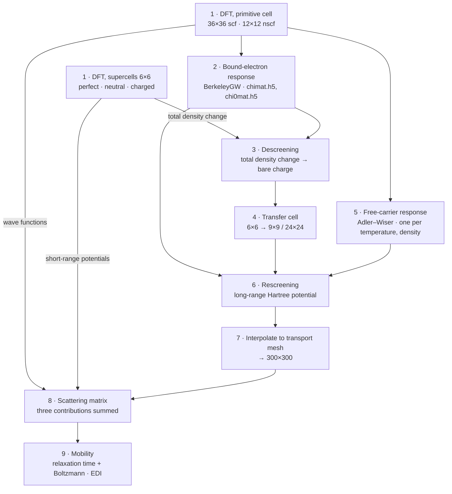

# Charged Defect Scattering from First Principles

[](https://doi.org/10.1103/42pc-t2bx)
[](https://github.com/yuanyue-liu-group/EDI)

A method for computing how electrons scatter off **charged** point defects, and the carrier
mobility that follows — without assuming what the defect's bare charge distribution looks like.

The bare (unscreened) excess charge is instead **derived** from a small-supercell DFT calculation
by removing the material's own screening from it. That charge is localized, so it can be moved into
an arbitrarily large cell and re-screened there, giving the long-range scattering potential that a
direct DFT supercell could never afford. Screening is treated with the full dielectric matrix, and
free carriers enter through a temperature- and density-dependent polarizability rather than a
Thomas–Fermi or Lindhard model.

## Why charged defects are hard

The quantity to compute is the scattering matrix element

$$M_{n,n'}(\mathbf{k},\mathbf{k}') = \langle n'\mathbf{k}' | \Delta V | n\mathbf{k} \rangle$$

where $|n\mathbf{k}\rangle$ and $|n'\mathbf{k}'\rangle$ are the initial and final states and
$\Delta V$ is the potential the defect introduces. For a *neutral* defect $\Delta V$ is short
ranged, so a medium-sized supercell captures it and the matrix element follows directly.

A *charged* defect is different. Its $\Delta V$ carries a long-range Coulomb tail, and resolving
that tail in DFT would need a supercell far too large to afford. The usual escape is to build
$\Delta V$ from the bare excess charge $\Delta\rho_\mathrm{b}$ plus the material's screening — but
$\Delta\rho_\mathrm{b}$ is not something DFT hands you, so it has been *assumed*: a point charge, a
Gaussian, or a Kohn–Sham defect orbital. Screening is often approximated too, by a single
dielectric constant or a model response function. Both assumptions propagate straight into
$M_{n,n'}$ and into every transport property computed from it.

This method removes both assumptions.

## Method

### Splitting the perturbation

Decompose the formation of the charged defect into two steps: a perfect structure (PS) becoming a
neutral defective structure (NS), with the atoms already at the charged-defect positions; and that
structure then becoming charged (CS).

$$\Delta V = \Delta V^{\mathrm{PS}\to\mathrm{NS}} + \Delta V^{\mathrm{NS}\to\mathrm{CS}}, \qquad \Delta V^{\mathrm{NS}\to\mathrm{CS}} = \Delta V_\mathrm{XC}^{\mathrm{NS}\to\mathrm{CS}} + \Delta V_\mathrm{H}^{\mathrm{NS}\to\mathrm{CS}}$$

The point of splitting this way is that $\Delta V^{\mathrm{PS}\to\mathrm{NS}}$ and
$\Delta V_\mathrm{XC}^{\mathrm{NS}\to\mathrm{CS}}$ are short ranged and converge quickly with
supercell size, so both come straight from modest DFT supercells. Only the Hartree term
$\Delta V_\mathrm{H}^{\mathrm{NS}\to\mathrm{CS}}$ is long ranged, and only it needs the machinery
below.

### Descreening — recovering the bare charge

Strip the bound-electron screening off the DFT density change:

$$\Delta\rho_\mathrm{b} = \Delta\rho_\mathrm{tot} - \chi^0_\mathrm{b}\thinspace v \left( \Delta\rho_\mathrm{tot} - \frac{Q}{\Omega} \right)$$

Here $Q$ is the defect charge, $\Omega$ the supercell volume, $v$ the Coulomb kernel, and
$\chi^0_\mathrm{b}$ the bound-electron polarizability of the primitive cell. The $Q/\Omega$ term is
the jellium background that compensates the extra charge in the DFT calculation. Expanded in
reciprocal space, with $\mathbf{q}_\mathrm{s}+\mathbf{G}$ the reciprocal lattice vectors of the
small supercell:

$$\Delta\rho_\mathrm{b}(\mathbf{q}_\mathrm{s}+\mathbf{G}) = \Delta\rho_\mathrm{tot}(\mathbf{q}_\mathrm{s}+\mathbf{G}) - \sum_{\mathbf{G}'} \chi^0_\mathrm{b}(\mathbf{q}_\mathrm{s}+\mathbf{G},\thinspace \mathbf{q}_\mathrm{s}+\mathbf{G}')\thinspace \frac{4\pi}{|\mathbf{q}_\mathrm{s}+\mathbf{G}'|^2} \left[ \Delta\rho_\mathrm{tot}(\mathbf{q}_\mathrm{s}+\mathbf{G}') - \delta_{\mathbf{q}_\mathrm{s}+\mathbf{G}',0}\frac{Q}{\Omega} \right]$$

> [!NOTE]
> This is what makes the whole approach work: unlike the long-ranged
> $\Delta V_\mathrm{H}^{\mathrm{NS}\to\mathrm{CS}}$, the bare charge $\Delta\rho_\mathrm{b}$ is
> **localized** around the defect. A small supercell is therefore enough to obtain it.

### Rescreening — the potential at any cell size

Because $\Delta\rho_\mathrm{b}$ is localized, transfer it into an arbitrarily large supercell and
screen it there:

$$\Delta V_\mathrm{H}^{\mathrm{NS}\to\mathrm{CS}} = W \Delta\rho_\mathrm{b}, \qquad W = \left( I - v\chi^0 \right)^{-1} v, \qquad \chi^0 = \chi^0_\mathrm{b} + \chi^0_\mathrm{c}$$

$$\Delta V_\mathrm{H}^{\mathrm{NS}\to\mathrm{CS}}(\mathbf{q}_\mathrm{l}+\mathbf{G}) = \sum_{\mathbf{G}'} W(\mathbf{q}_\mathrm{l}+\mathbf{G},\thinspace \mathbf{q}_\mathrm{l}+\mathbf{G}')\thinspace \Delta\rho_\mathrm{b}(\mathbf{q}_\mathrm{l}+\mathbf{G}')$$

$W$ is the screened interaction under the random phase approximation. As the spacing between
$\mathbf{q}_\mathrm{l}+\mathbf{G}$ becomes infinitely small, this yields
$\Delta V_\mathrm{H}$ for an **isolated** defect — the limit a periodic supercell can only
approach.

The transfer itself is three steps: inverse-FFT $\Delta\rho_\mathrm{b}$ to real space, set it to
zero in the extended region, forward-FFT on the larger cell.

### Free-carrier screening

$\chi^0$ splits into a bound-electron part and a free-carrier part,
$\chi^0 = \chi^0_\mathrm{b} + \chi^0_\mathrm{c}$, both obtainable from the primitive cell. The free
carriers are what make the scattering depend on temperature and doping, so they are worth treating
properly rather than with a homogeneous-electron-gas model — especially in 2D, where carriers are
often assumed confined to a zero-thickness plane.

$\chi^0_\mathrm{c}$ comes from the Adler–Wiser formula. Because the states near a band edge share a
similar out-of-plane distribution $\xi(z)$, it factorizes:

$$\chi^0_\mathrm{c}(\mathbf{q}_\parallel+\mathbf{G}_\parallel, z, z') = \xi(z)\thinspace \xi(z')\thinspace \frac{g_s}{A_\mathrm{UC}} \sum_{n_\mathrm{BE} n'_\mathrm{BE} \mathbf{k}} \frac{f_{n_\mathrm{BE}\mathbf{k}} - f_{n'_\mathrm{BE}\mathbf{k}+\mathbf{q}_\parallel}}{\epsilon_{n_\mathrm{BE}\mathbf{k}} - \epsilon_{n'_\mathrm{BE}\mathbf{k}+\mathbf{q}_\parallel}}\thinspace \phi_{n_\mathrm{BE}\mathbf{k},\thinspace n'_\mathrm{BE}\mathbf{k}+\mathbf{q}_\parallel+\mathbf{G}_\parallel}$$

where $\phi$ is the wave function overlap integral, $g_s$ the spin degeneracy, $f$ the Fermi–Dirac
occupation, and $A_\mathrm{UC}$ the unit cell area. The dominant transitions are those with a large
occupation difference, a small energy difference, and a large wave function overlap — hence the
restriction to states near the band edge.

Since $\xi(z)\xi(z')$ factors out, one $\chi^0_\mathrm{c}$ evaluation is needed per temperature and
carrier concentration, with the Fermi level solved from the target concentration.

### 2D materials

A 2D material is not periodic along $z$, and the relevant quantities have finite extent there.
Forcing 3D periodicity misrepresents both the open boundary and the finite thickness. Instead,
describe $z$ in real space while keeping the in-plane directions in reciprocal space. The Coulomb
kernel becomes

$$v(\mathbf{q}_\parallel, z-z') = 4\pi \int \frac{dq_z}{2\pi}\thinspace \frac{e^{i q_z (z-z')}}{q_\parallel^2 + q_z^2} = \frac{2\pi}{q_\parallel} e^{-q_\parallel |z-z'|}$$

and, taking the in-plane isotropic approximation (diagonal in $\mathbf{G}_\parallel$),

$$\varepsilon(\mathbf{q}_\parallel, z, z') = \delta(z-z') - 2\pi \int dz''\thinspace \frac{e^{-q_\parallel|z-z''|}}{q_\parallel}\thinspace \chi(\mathbf{q}_\parallel, z'', z')$$

$$W(\mathbf{q}_\parallel, z, z') = 2\pi \int dz''\thinspace \varepsilon^{-1}(\mathbf{q}_\parallel, z, z'')\thinspace \frac{e^{-q_\parallel |z''-z'|}}{q_\parallel}$$

$$\Delta V_\mathrm{H}^{\mathrm{NS}\to\mathrm{CS}}(\mathbf{q}_\parallel, z) = \int dz'\thinspace W(\mathbf{q}_\parallel, z, z')\thinspace \Delta\rho_\mathrm{b}(\mathbf{q}_\parallel, z')$$

### From matrix elements to mobility

With $\Delta V$ assembled from its three parts, the matrix elements give momentum relaxation times,
and the linearized Boltzmann transport equation gives the mobility:

$$\frac{1}{\tau_{n\mathbf{k}}} = \frac{2\pi}{\hbar} C_\mathrm{d} \sum_{n'} \int \frac{d\mathbf{k}'}{\Omega_\mathrm{BZ}}\thinspace M_{n,n'}(\mathbf{k},\mathbf{k}') \left( 1 - \frac{\mathbf{v}_{n'\mathbf{k}'}\cdot\mathbf{v}_{n\mathbf{k}}}{|\mathbf{v}_{n'\mathbf{k}'}||\mathbf{v}_{n\mathbf{k}}|} \right) \delta(E_{n\mathbf{k}} - E_{n'\mathbf{k}'})$$

$$\mu_{\alpha\beta} = \frac{|e|}{n_\mathrm{c}\Omega} \sum_n \int \frac{d\mathbf{k}}{\Omega_\mathrm{BZ}}\thinspace \frac{\partial f_{n\mathbf{k}}}{\partial E_{n\mathbf{k}}}\thinspace \tau_{n\mathbf{k}}\thinspace v_{n\mathbf{k},\alpha}\thinspace v_{n\mathbf{k},\beta}$$

with $C_\mathrm{d}$ the defect concentration and $n_\mathrm{c}$ the carrier density. The energy
delta is evaluated by triangle integration.

## Workflow



| # | Stage | Input | Output | Tool |
|:-:|---|---|---|---|
| 1 | Ground-state DFT | structures | $\Delta V^{\mathrm{PS}\to\mathrm{NS}}$, $\Delta V_\mathrm{XC}^{\mathrm{NS}\to\mathrm{CS}}$, $\Delta\rho_\mathrm{tot}$ | Quantum ESPRESSO |
| 2 | Bound-electron polarizability | wave functions | $\chi^0_\mathrm{b}$ | BerkeleyGW |
| 3 | **Descreening** | $\Delta\rho_\mathrm{tot}$, $\chi^0_\mathrm{b}$ | $\Delta\rho_\mathrm{b}$ | `potcorr` |
| 4 | Transfer to large supercell | $\Delta\rho_\mathrm{b}$, small cell | $\Delta\rho_\mathrm{b}$, large cell | `potcorr` |
| 5 | Free-carrier polarizability | bands, $E_\mathrm{F}(T, n_\mathrm{e})$ | $\chi^0_\mathrm{c}$, $\xi(z)$ | `potcorr` |
| 6 | **Rescreening** | $\Delta\rho_\mathrm{b}$, $\chi^0$ | $\Delta V_\mathrm{H}^{\mathrm{NS}\to\mathrm{CS}}$ | `potcorr` |
| 7 | Interpolate to transport mesh | $\Delta V_\mathrm{H}^{\mathrm{NS}\to\mathrm{CS}}$ | same, on a dense mesh | `potcorr` |
| 8 | Scattering matrix | potentials, wave functions | $M_{n,n'}(\mathbf{k},\mathbf{k}')$ | `potcorr` |
| 9 | Mobility | $M_{n,n'}(\mathbf{k},\mathbf{k}')$ | $\tau_{n\mathbf{k}}$, $\mu_{\alpha\beta}$ | [EDI](https://github.com/yuanyue-liu-group/EDI) |

Three things worth knowing before running it:

- **Stage 2 must be repeated per cell size.** The q-grid of $\chi^0_\mathrm{b}$ has to match the
  supercell it is used with, so descreening and rescreening generally need different runs.
- **Stage 5 is an independent branch**, and repeats for every temperature and carrier
  concentration. That loop dominates the cost of a full mobility-versus-$T$-and-$n_\mathrm{e}$ map.
- **Stage 6 can be checked directly.** Descreen from a small supercell, rescreen into a
  medium one, and compare against a direct DFT calculation at that medium size. The two should
  agree — a cheap and decisive validation of the whole descreen/rescreen chain.

The grid sizes in the diagram are those of the reference implementation; they are illustrative, not
fixed.

## Reference parameters

Values from the reference calculation on monolayer MoS<sub>2</sub>. Treat them as a starting point
for a new system, not as requirements.

| Setting | Value |
|---|---|
| Functional / pseudopotentials | PBE · SG15 optimized norm-conserving Vanderbilt |
| Wave function cutoff | 60 Ry |
| Out-of-plane cell length | 24 Å |
| Spin–orbit coupling | neglected (negligible for the conduction bands of interest) |
| Primitive-cell k-grids | 36 × 36 (scf) · 12 × 12 (nscf) |
| Defect supercells | 6 × 6 primitive cells · 3 × 3 × 1 k-grid |
| Unoccupied states in $\chi^0$ | 400 |
| q-grid sampling | nonuniform neck subsampling near $q=0$ |
| Transport mesh | 300 × 300 |

Two practical notes. Aligning $\Delta V^{\mathrm{PS}\to\mathrm{NS}}$ against
$\Delta V_\mathrm{XC}^{\mathrm{NS}\to\mathrm{CS}}$ needs a common reference — the vacuum level
serves for a 2D material. And $\Delta\rho_\mathrm{b}$ should be checked for convergence against the
out-of-plane cell length; over 20–36 Å it was found insensitive.

## Code

The descreening and rescreening implementation is in [`code/`](code/).
See [`code/README.md`](code/README.md) for installation and a driver script per
workflow stage, and [`code/docs/METHOD.md`](code/docs/METHOD.md) for a map from
each equation above into the source.

| Component | Role |
|---|---|
| [`code/potcorr/core.py`](code/potcorr/core.py) | Coulomb kernels, $\chi^0 \to \varepsilon \to W$, descreening and rescreening operators, symmetry expansion from the irreducible to the full Brillouin zone |
| [`code/potcorr/quasi2d.py`](code/potcorr/quasi2d.py) | Quasi-2D open-boundary screening, $W(q_\parallel, z, z')$ — the route behind the mobility results |
| [`code/potcorr/bgw.py`](code/potcorr/bgw.py) | Reader for BerkeleyGW polarizability and dielectric matrices |
| [`code/potcorr/io_xsf.py`](code/potcorr/io_xsf.py), [`code/potcorr/grid.py`](code/potcorr/grid.py) | Grid I/O, supercell expansion and coarsening |
| [`code/potcorr/cells.py`](code/potcorr/cells.py) | Per-system configuration: lattice, supercell, FFT grid, symmetry operations |
| `calcmat.py` | Scattering matrix elements from wave functions and perturbation potentials — step 8, not part of this repository |
| [EDI](https://github.com/yuanyue-liu-group/EDI) | Electron–defect interaction and Boltzmann transport solver |

## Reference

The method is described, derived and validated in:

> R. Guo, K. Kim, Z. Xiao, and Y. Liu,
> *Accurate Ab Initio Method for Charged Defect Scattering*,
> Phys. Rev. Lett. **135**, 126302 (2025).
> [doi:10.1103/42pc-t2bx](https://doi.org/10.1103/42pc-t2bx)

```bibtex
@article{Guo2025ChargedDefect,
  title   = {Accurate Ab Initio Method for Charged Defect Scattering},
  author  = {Guo, Rongjing and Kim, Kwangrae and Xiao, Zhongcan and Liu, Yuanyue},
  journal = {Physical Review Letters},
  volume  = {135},
  number  = {12},
  pages   = {126302},
  year    = {2025},
  doi     = {10.1103/42pc-t2bx}
}
```

Developed in the [Liu group](https://github.com/yuanyue-liu-group), Texas Materials Institute and
Department of Mechanical Engineering, The University of Texas at Austin. Correspondence:
[Yuanyue.liu@austin.utexas.edu](mailto:Yuanyue.liu@austin.utexas.edu).

Supported by the Office of Naval Research (N00014-23-1-2400), NSF (2425545), the Welch Foundation
(F-1959), and DOE EERE (DE-EE0052781). Calculations were performed on the clusters of ACCESS,
TACC, and NREL.
