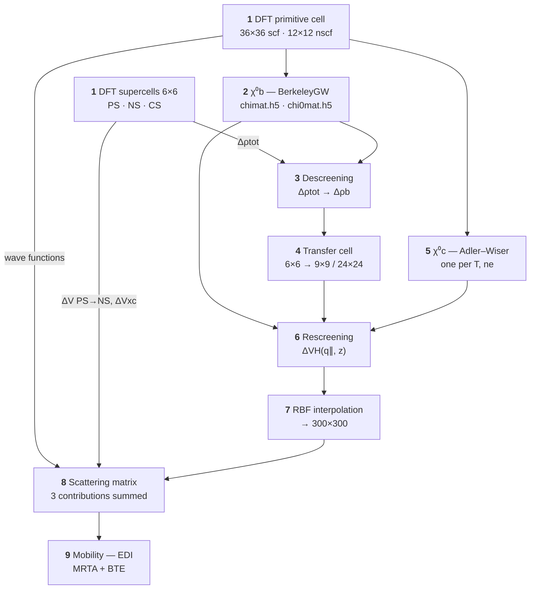

# Accurate *Ab Initio* Method for Charged Defect Scattering

[-b31b1b)](https://doi.org/10.1103/42pc-t2bx)
[](https://doi.org/10.1103/42pc-t2bx)
[](https://github.com/yuanyue-liu-group/EDI)

**Rongjing Guo, Kwangrae Kim, Zhongcan Xiao, and Yuanyue Liu**\*

Texas Materials Institute and Department of Mechanical Engineering,
The University of Texas at Austin, Austin, Texas 78712, USA

\*Correspondence: [Yuanyue.liu@austin.utexas.edu](mailto:Yuanyue.liu@austin.utexas.edu)

---

## Abstract

Charged defect scattering of electrons plays a critical role in determining a wide range of
material properties. However, there is a lack of an accurate method to calculate the scattering,
as all the existing methods require assuming a specific distribution for unscreened (i.e., bare)
excess charge carried by the defect, which limits their accuracy. Here we develop a
first-principles method to determine the bare charge distribution, which thus enables accurate
calculations of the scattering. Using this method, we accurately calculate the electron mobility
of 2D MoS<sub>2</sub> under the scattering of charged sulfur vacancies and compare with that of
charge-neutral oxygen substitutes of sulfur. Interestingly, we find that the charged
defect-limited mobility exhibits a strong temperature dependence at low temperature and carrier
concentration, in contrast with the neutral defect and the conventional belief that the
defect-limited mobility is less sensitive to the temperature. This behavior arises from the free
carrier screening of the long-range scattering potential of the charged defect.

## The problem

The quantity to compute is the scattering matrix element

$$M_{n,n'}(\mathbf{k},\mathbf{k}') = \langle n'\mathbf{k}' | \Delta V | n\mathbf{k} \rangle$$

where $|n\mathbf{k}\rangle$ and $|n'\mathbf{k}'\rangle$ are the initial and final states. The
difficulty is that $\Delta V$ for a charged defect carries a long-range Coulomb component, so
capturing it accurately in DFT would require a supercell far too large to afford.

The alternative is to build $\Delta V$ from the **bare** (unscreened) excess charge
$\Delta\rho_\mathrm{b}$ plus the material's screening. But $\Delta\rho_\mathrm{b}$ was previously
unknown, so it had to be *assumed* — a point charge, a Gaussian, or a Kohn–Sham defect orbital.
Those assumptions propagate straight into the scattering matrix and the transport.

**This work determines $\Delta\rho_\mathrm{b}$ from first principles instead.**

## Method

Decompose the formation of the charged defect into two steps: a perfect structure (PS) becoming a
neutral defective structure (NS), with the atoms already at the charged-defect positions; and that
structure then becoming charged (CS).

$$\Delta V = \Delta V^{\mathrm{PS}\to\mathrm{NS}} + \Delta V^{\mathrm{NS}\to\mathrm{CS}}, \qquad \Delta V^{\mathrm{NS}\to\mathrm{CS}} = \Delta V_\mathrm{XC}^{\mathrm{NS}\to\mathrm{CS}} + \Delta V_\mathrm{H}^{\mathrm{NS}\to\mathrm{CS}}$$

$\Delta V^{\mathrm{PS}\to\mathrm{NS}}$ and $\Delta V_\mathrm{XC}^{\mathrm{NS}\to\mathrm{CS}}$ are
short ranged and converge quickly with supercell size, so both come from modest DFT supercells.
Only the Hartree term $\Delta V_\mathrm{H}^{\mathrm{NS}\to\mathrm{CS}}$ is long ranged, and only it
needs the machinery below.

### Descreening

Strip the bound-electron screening off the DFT density change to recover the bare charge:

$$\Delta\rho_\mathrm{b} = \Delta\rho_\mathrm{tot} - \chi^0_\mathrm{b}\thinspace v \left( \Delta\rho_\mathrm{tot} - \frac{Q}{\Omega} \right)$$

Here $Q$ is the defect charge, $\Omega$ the supercell volume, $v$ the Coulomb kernel, and
$\chi^0_\mathrm{b}$ the bound-electron polarizability of the primitive cell. The $Q/\Omega$ term is
the jellium background that compensates the extra charge in the DFT calculation. In reciprocal
space, with $\mathbf{q}_\mathrm{s}+\mathbf{G}$ the reciprocal lattice vectors of the small
supercell:

$$\Delta\rho_\mathrm{b}(\mathbf{q}_\mathrm{s}+\mathbf{G}) = \Delta\rho_\mathrm{tot}(\mathbf{q}_\mathrm{s}+\mathbf{G}) - \sum_{\mathbf{G}'} \chi^0_\mathrm{b}(\mathbf{q}_\mathrm{s}+\mathbf{G},\thinspace \mathbf{q}_\mathrm{s}+\mathbf{G}')\thinspace \frac{4\pi}{|\mathbf{q}_\mathrm{s}+\mathbf{G}'|^2} \left[ \Delta\rho_\mathrm{tot}(\mathbf{q}_\mathrm{s}+\mathbf{G}') - \delta_{\mathbf{q}_\mathrm{s}+\mathbf{G}',0}\frac{Q}{\Omega} \right]$$

> [!NOTE]
> The key observation: unlike the long-ranged
> $\Delta V_\mathrm{H}^{\mathrm{NS}\to\mathrm{CS}}$, the bare charge
> $\Delta\rho_\mathrm{b}$ is **localized** around the defect. That is exactly why a small
> supercell suffices to obtain it.

### Rescreening

Because $\Delta\rho_\mathrm{b}$ is localized, transfer it to an arbitrarily large supercell and
screen it there:

$$\Delta V_\mathrm{H}^{\mathrm{NS}\to\mathrm{CS}} = W \Delta\rho_\mathrm{b}, \qquad W = \left( I - v\chi^0 \right)^{-1} v, \qquad \chi^0 = \chi^0_\mathrm{b} + \chi^0_\mathrm{c}$$

$$\Delta V_\mathrm{H}^{\mathrm{NS}\to\mathrm{CS}}(\mathbf{q}_\mathrm{l}+\mathbf{G}) = \sum_{\mathbf{G}'} W(\mathbf{q}_\mathrm{l}+\mathbf{G},\thinspace \mathbf{q}_\mathrm{l}+\mathbf{G}')\thinspace \Delta\rho_\mathrm{b}(\mathbf{q}_\mathrm{l}+\mathbf{G}')$$

As the spacing between $\mathbf{q}_\mathrm{l}+\mathbf{G}$ becomes infinitely small, this yields
$\Delta V_\mathrm{H}$ for an isolated defect.

Free carriers enter through $\chi^0_\mathrm{c}$. Rather than a Thomas–Fermi or Lindhard model —
which approximates the carriers as a homogeneous electron gas with plane-wave wave functions, and
for 2D materials often confines them to a zero-thickness plane — $\chi^0_\mathrm{c}$ is computed
from the Adler–Wiser formula. Since the states near the band edge of MoS<sub>2</sub> share a
similar out-of-plane distribution $\xi(z)$, it factorizes:

$$\chi^0_\mathrm{c}(\mathbf{q}_\parallel+\mathbf{G}_\parallel, z, z') = \xi(z)\thinspace \xi(z')\thinspace \frac{g_s}{A_\mathrm{UC}} \sum_{n_\mathrm{BE} n'_\mathrm{BE} \mathbf{k}} \frac{f_{n_\mathrm{BE}\mathbf{k}} - f_{n'_\mathrm{BE}\mathbf{k}+\mathbf{q}_\parallel}}{\epsilon_{n_\mathrm{BE}\mathbf{k}} - \epsilon_{n'_\mathrm{BE}\mathbf{k}+\mathbf{q}_\parallel}}\thinspace \phi_{n_\mathrm{BE}\mathbf{k},\thinspace n'_\mathrm{BE}\mathbf{k}+\mathbf{q}_\parallel+\mathbf{G}_\parallel}$$

where $\phi$ is the wave function overlap integral and $g_s$ the spin degeneracy. This dependence
on temperature and carrier concentration is what drives the main result.

### Quasi-2D treatment

A 2D material is not periodic along $z$, and the relevant quantities have finite extent there. To
respect that open boundary and the finite thickness, $z$ is described in real space while the
in-plane directions stay in reciprocal space. The Coulomb kernel becomes

$$v(\mathbf{q}_\parallel, z-z') = 4\pi \int \frac{dq_z}{2\pi}\thinspace \frac{e^{i q_z (z-z')}}{q_\parallel^2 + q_z^2} = \frac{2\pi}{q_\parallel} e^{-q_\parallel |z-z'|}$$

and, taking the in-plane isotropic approximation (diagonal in $\mathbf{G}_\parallel$),

$$\varepsilon(\mathbf{q}_\parallel, z, z') = \delta(z-z') - 2\pi \int dz''\thinspace \frac{e^{-q_\parallel|z-z''|}}{q_\parallel}\thinspace \chi(\mathbf{q}_\parallel, z'', z')$$

$$W(\mathbf{q}_\parallel, z, z') = 2\pi \int dz''\thinspace \varepsilon^{-1}(\mathbf{q}_\parallel, z, z'')\thinspace \frac{e^{-q_\parallel |z''-z'|}}{q_\parallel}$$

$$\Delta V_\mathrm{H}^{\mathrm{NS}\to\mathrm{CS}}(\mathbf{q}_\parallel, z) = \int dz'\thinspace W(\mathbf{q}_\parallel, z, z')\thinspace \Delta\rho_\mathrm{b}(\mathbf{q}_\parallel, z')$$

### Transport

Momentum relaxation times follow from the matrix elements, then the linearized Boltzmann
transport equation gives the mobility:

$$\frac{1}{\tau_{n\mathbf{k}}} = \frac{2\pi}{\hbar} C_\mathrm{d} \sum_{n'} \int \frac{d\mathbf{k}'}{\Omega_\mathrm{BZ}}\thinspace M_{n,n'}(\mathbf{k},\mathbf{k}') \left( 1 - \frac{\mathbf{v}_{n'\mathbf{k}'}\cdot\mathbf{v}_{n\mathbf{k}}}{|\mathbf{v}_{n'\mathbf{k}'}||\mathbf{v}_{n\mathbf{k}}|} \right) \delta(E_{n\mathbf{k}} - E_{n'\mathbf{k}'})$$

$$\mu_{\alpha\beta} = \frac{|e|}{n_\mathrm{c}\Omega} \sum_n \int \frac{d\mathbf{k}}{\Omega_\mathrm{BZ}}\thinspace \frac{\partial f_{n\mathbf{k}}}{\partial E_{n\mathbf{k}}}\thinspace \tau_{n\mathbf{k}}\thinspace v_{n\mathbf{k},\alpha}\thinspace v_{n\mathbf{k},\beta}$$

with $C_\mathrm{d}$ the defect concentration.

## Workflow



| # | Stage | In → Out | Tool |
|:-:|---|---|---|
| 1 | Ground-state DFT | structures → $\Delta V^{\mathrm{PS}\to\mathrm{NS}}$, $\Delta V_\mathrm{XC}$, $\Delta\rho_\mathrm{tot}$ | Quantum ESPRESSO |
| 2 | Bound-electron polarizability | wave functions → $\chi^0_\mathrm{b}$ | BerkeleyGW |
| 3 | **Descreening** | $\Delta\rho_\mathrm{tot}$, $\chi^0_\mathrm{b}$ → $\Delta\rho_\mathrm{b}$ | `potcorr` |
| 4 | Transfer to large supercell | $\Delta\rho_\mathrm{b}$ small → large | `potcorr` |
| 5 | Free-carrier polarizability | bands, $E_\mathrm{F}(T, n_\mathrm{e})$ → $\chi^0_\mathrm{c}$, $\xi(z)$ | `potcorr` |
| 6 | **Rescreening** | $\Delta\rho_\mathrm{b}$, $\chi^0$ → $\Delta V_\mathrm{H}$ | `potcorr` |
| 7 | Interpolate to transport mesh | $\Delta V_\mathrm{H}$ → 300×300 | `potcorr` |
| 8 | Scattering matrix | potentials, wave functions → $M_{n,n'}$ | `potcorr` |
| 9 | Mobility | $M_{n,n'}$ → $\tau$, $\mu$ | [EDI](https://github.com/yuanyue-liu-group/EDI) |

Stage 5 is an independent branch and must be repeated for every temperature and carrier
concentration. Stage 6 is validated against a direct DFT calculation of a 9×9 supercell — the
descreened-then-rescreened $\Delta V_\mathrm{H}$ matches it closely.

## Results for 2D MoS<sub>2</sub>

Applied to the two dominant defects: the $-1$ charged sulfur vacancy
(V<sub>S</sub><sup>−1</sup>) and the charge-neutral oxygen substitute of sulfur (O<sub>S</sub>).

| Observation | Charged V<sub>S</sub><sup>−1</sup> | Neutral O<sub>S</sub> |
|---|---|---|
| Mobility vs. temperature, below 150 K at $10^{11}$ cm<sup>−2</sup> | $\sim T^{-0.35}$ | nearly flat |
| Mobility vs. carrier concentration | rises, peaks near $10^{13}$ cm<sup>−2</sup>, then falls | falls monotonically |
| Sensitive to free-carrier screening | yes | no |

Two consequences:

- **The temperature dependence is unexpected.** Defect-limited mobility is conventionally taken to
  be temperature insensitive at low $T$ — true for the neutral defect, but not for the charged one.
  Higher $T$ weakens $\chi^0_\mathrm{c}$, weakening the screening of
  $\Delta V_\mathrm{H}^{\mathrm{NS}\to\mathrm{CS}}$ and so strengthening the scattering.
- **Per-defect, the charged vacancy scatters harder.** To limit the mobility as much as
  O<sub>S</sub> does, the V<sub>S</sub><sup>−1</sup> concentration needs to be below **0.45×** that
  of O<sub>S</sub>.

Combining the calculated defect- and phonon-limited mobilities by Matthiessen's rule reproduces
measured mobilities of 2D MoS<sub>2</sub>, with fitted defect concentrations consistent with
reported values.

## Computational details

| Setting | Value |
|---|---|
| Functional / pseudopotentials | PBE · SG15 optimized norm-conserving Vanderbilt |
| Wave function cutoff | 60 Ry |
| Out-of-plane cell length | 24 Å |
| Spin–orbit coupling | neglected (negligible for MoS<sub>2</sub> conduction bands) |
| Primitive-cell k-grids | 36 × 36 (scf) · 12 × 12 (nscf) |
| Defect supercells | 6 × 6 primitive cells · 3 × 3 × 1 k-grid |
| Unoccupied states in $\chi^0$ | 400 |
| q-grid sampling | nonuniform neck subsampling near $q=0$ |
| Transport mesh | 300 × 300 |

Alignment between $\Delta V^{\mathrm{PS}\to\mathrm{NS}}$ and
$\Delta V_\mathrm{XC}^{\mathrm{NS}\to\mathrm{CS}}$ uses the vacuum level as reference.
Convergence of $\Delta\rho_\mathrm{b}$ with the out-of-plane cell length was verified over
20–36 Å.

## Code

| Component | Role |
|---|---|
| `potcorr.py` | Coulomb kernels, $\chi^0 \to \varepsilon \to W$, descreening and rescreening operators, symmetry expansion from the irreducible to the full Brillouin zone |
| `read_eps.py` | Reader for BerkeleyGW polarizability and dielectric matrices |
| `io_xsf.py`, `utli.py` | Grid I/O, supercell expansion and coarsening |
| `calcmat.py` | Scattering matrix elements from wave functions and perturbation potentials |
| `lab.py` | Per-system configuration: lattice, supercell, FFT grid, symmetry operations |
| [EDI](https://github.com/yuanyue-liu-group/EDI) | Electron–defect interaction and Boltzmann transport solver |

## Citation

```bibtex
@article{Guo2025ChargedDefect,
  title   = {Accurate Ab Initio Method for Charged Defect Scattering},
  author  = {Guo, Rongjing and Kim, Kwangrae and Xiao, Zhongcan and Liu, Yuanyue},
  journal = {Physical Review Letters},
  volume  = {135},
  number  = {12},
  pages   = {126302},
  year    = {2025},
  doi     = {10.1103/42pc-t2bx}
}
```

## Acknowledgments

Supported by the Office of Naval Research (N00014-23-1-2400), NSF (2425545), the Welch Foundation
(F-1959), and DOE EERE (DE-EE0052781). Calculations were performed on the clusters of ACCESS,
TACC, and NREL.
